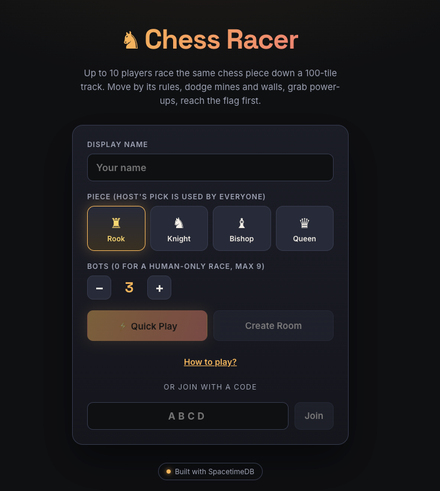

# ♞ Chess Racer

A real-time multiplayer racing game where up to 10 players race the same chess
piece down a 100-tile track, moving only by that piece's legal vectors while
dodging walls and pawn mines, grabbing power-ups, and navigating fog. Built on
**SpacetimeDB** as the authoritative real-time backend.

**Play it live:** https://chess-racer.vercel.app

  

The game lives in [`chess-race/`](chess-race/) - see its
[README](chess-race/README.md) for architecture and local development.

## Stack

- **Backend:** a SpacetimeDB module (TypeScript to WebAssembly) on Maincloud.
  Every move is a reducer; all game state lives in tables and syncs to clients
  in real time. There is no separate game server.
- **Frontend:** React + Vite, deployed as a static site on Vercel.
